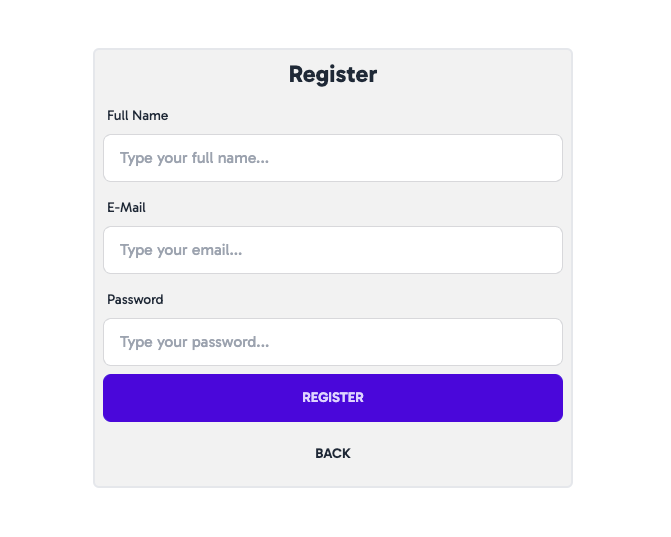
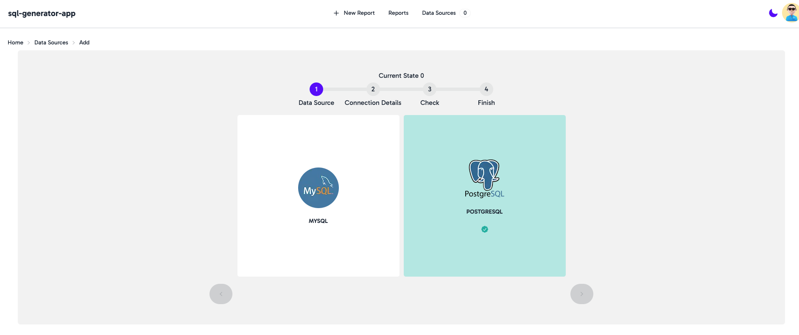
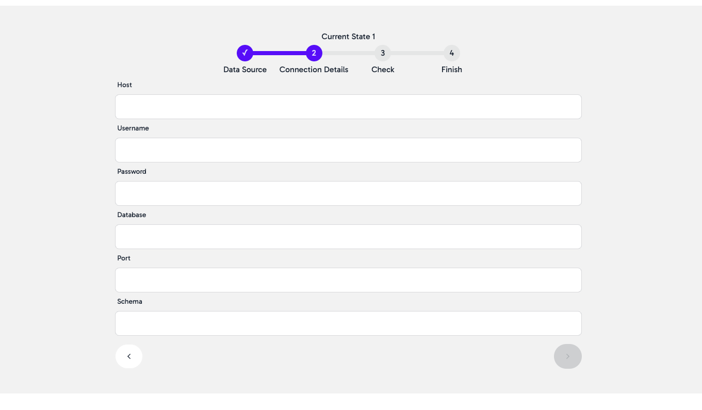
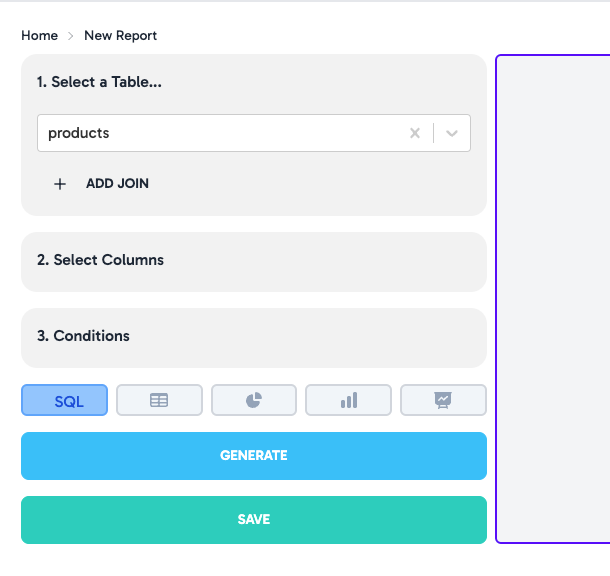
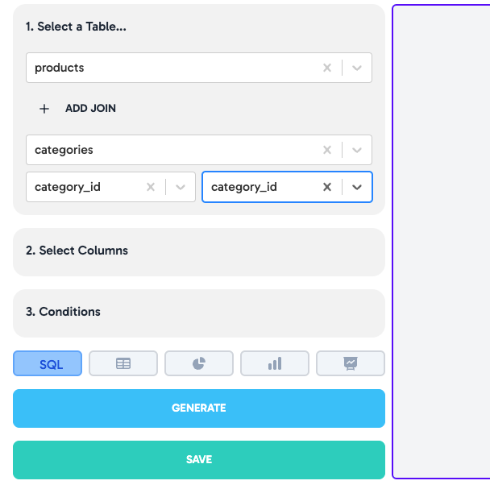
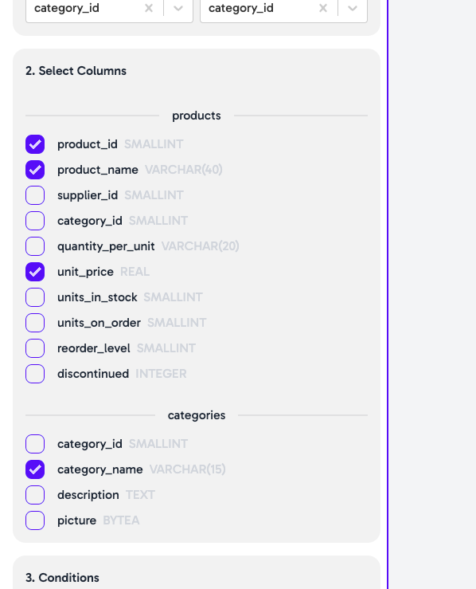
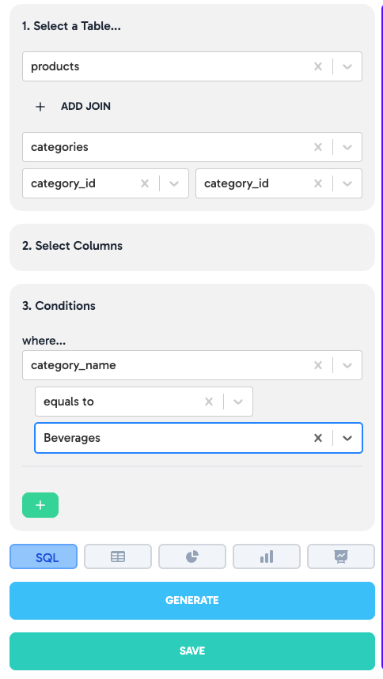
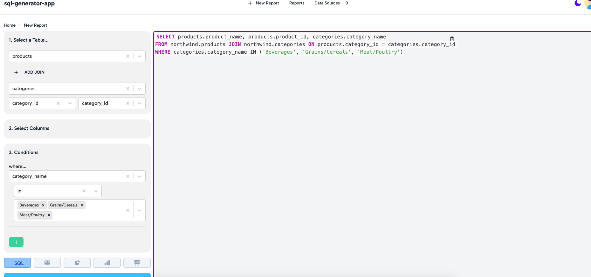
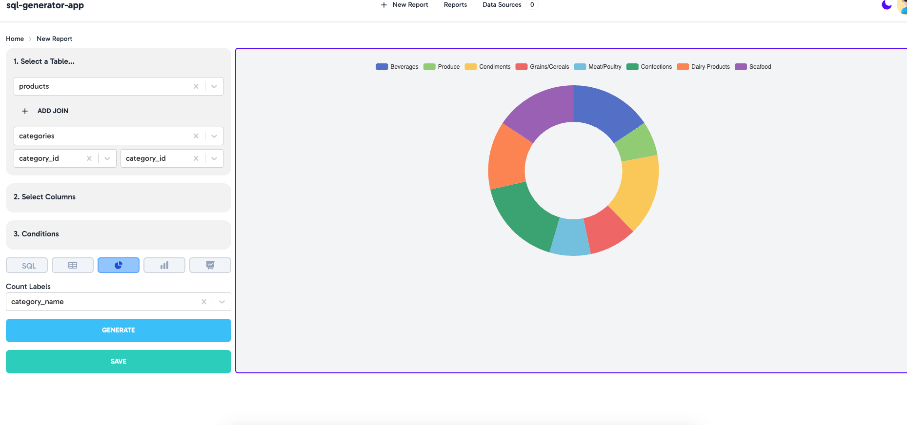
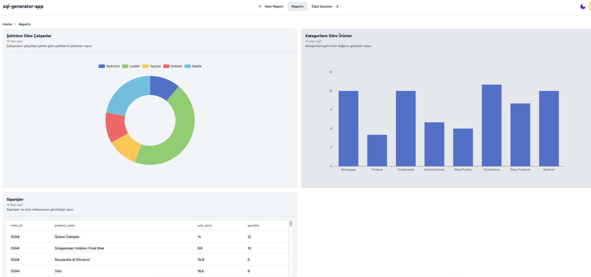

<h1>sql-generate-app</h1>
<p>
    The primary objective of this project is to empower individuals with little to no knowledge of SQL queries to easily and swiftly extract necessary information from databases.
    Our user-friendly interface allows the creation of complex SQL queries through simple selections, aiming to democratize access to data analysis. This approach effectively    
    removes the barrier of technical knowledge in extracting valuable insights from databases.
</p>

## Tech Stack

- Python 3.11
- Typescript
- FastAPI
- Poetry
- Alembic
- Apache ECharts
- Next Auth
- Redux

---

## Installation

### 1. Clone the project

```bash
    git clone https://github.com/ebubekir/sql-generate-app
```

### 2. Go to path

```bash
    cd sql-generate-app/
```

### 3. Backend Installation

#### 3.1 Go to backend directory.
   
    ```bash
        cd backend/
    ```

#### 3.2 Create Poetry Environment and Install Dependencies
    
    ```bash
       poetry shell && poetry install
    ```
   
#### 3.3 Up Database
    
    ```bash
       sudo docker compose up db
    ```
   
#### 3.4 Run api project
    ```bash
        python main.py
    ```

### 4. Frontend Installation

#### 4.1 Run dependencies

```bash
    yarn install
```

#### 4.2 Run project

```bash
    yarn dev
```

---

## Usage

### Register a User
Firstly, you need to register to log into the application.



### Add your data source
Add your data source in data sources page.


Add your connection details


When it's ok. Give it a name and save.

### Create a Query

Select your table.


Also if you want, you can join your tables with ADD JOIN button.


Select columns.


You can add conditions with conditions panel.


Then go create a Query!

---

## Features

### Pie, Bar, Line Responses.

You can choose a different char types like pie, bar, line.




### You can save your reports for viewing later.

